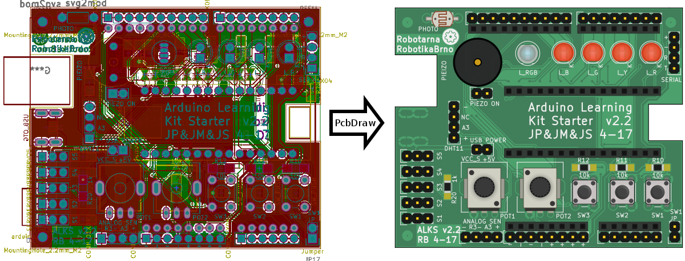

# PcbDraw

Convert your KiCAD boards into nice looking 2D drawings suitable for pinout
diagrams. Never draw them manually again!



This small Python script takes a KiCAD board (.kicad_pcb file) and produces a 2D
nice looking drawing of the board as an SVG file. This allows you to quickly and
automatically create awesome pinout diagrams for your project. These diagrams
are much easier to read than a labeled photo of a physical board or an actual
KiCAD design.

You and your users will love them!

## Dependencies

This script requires the `pcbnew` Python module (should come with KiCAD), the
`argparse` and `lxlml` modules. No other dependencies are needed.

PcbDraw also needs a module library to work. This library is maintained as a
separate repository: [PcbDraw-Lib](https://github.com/yaqwsx/PcbDraw-Lib).

## Usage

Usage of PcbDraw is simple, just run:

```.{bash}
./pcbdraw.py <style> <library> <output_file> <input_file>
```
- `style` is a path to a JSON file containing board colours definition. Several
  example styles are in the styles directory.
- `library` is a path to a directory containing module library. Modules are
  component footprints in SVG format.
- `output_file` is a path to an output SVG file
- `input_file` is a path to an `*.kicad_pcb` file

The script will output several debug messages of KiCAD Python API you can
ignore. I haven't found a way to disable them. If there is a missing module in
the library, the script will output warning.

There are several options for the script:

- `--list-components` prints a list of all components from the front side of PCB.
  Doesn't produce drawing.
- `--placeholder` shows a red square in the drawing for missing modules.
- `--remap` takes a path to a JSON file containing a dictionary from component
  references to alternative modules to change a module for given component. This
  allows you to e.g. choose different colors for LEDs without a need to change
  original board and create new packages for different colors. Format of
  dictionary entry is `"<ref>": "<library>:<module>"`  - e.g. `"PHOTO1":
  "Resistors:R_PHOTO_7mm"`.

## Writing Custom Styles

Style is a JSON file contain color definitions for the board substrate (they
don't have any effect on modules):

```.{json}
{
    "copper": "#417e5a",
    "board": "#4ca06c",
    "silk": "#f0f0f0",
    "pads": "#b5ae30",
    "outline": "#000000"
}
```

Colors are in HEX format, names of the colors should be self descriptive.

## Module Library

Library is a collection of SVG files each containing one drawing of a component.
The library structure follows KiCAD library structure - each footprint (module)
is a separate file placed in directories representing libraries.

It is also possible to have multiple libraries with different component style.

All the details about the library can be found in [its
repository](https://github.com/yaqwsx/PcbDraw-Lib). Note that the library is
essential for this script and unfortunately it is still incomplete -
contributions are welcomed! Drawing a single component from scratch takes less
than 10 minutes, which is not much time. Please, send a pull-request for
components you have created.

## Eagle Boards

Boards from Eagle CAD are not supported directly now. You can import an Eagle
board into KiCAD and then feed it into PcbDraw. This works fine (PcbDraw can
deal with different layer names, etc.), however there are minor flaws with the
import and user labels and via stitching can disappear (which is usually fine
for the purposes of drawing).

## Contributing

Feel free to submit issues and pull requests!

## Future Work

- make reasonably complete module library
- produce nicer SVG file structures (make SVG smaller by including each module
  exactly once, treat ids correctly,...)
- show through-hole pads in copper
- support value labels on modules
- maybe supported Eagle boards directly (now you can import them into KiCAD and
  export as kicad_pcb)
- make module origin more flexible
